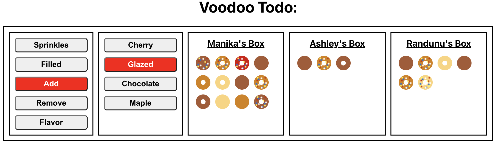
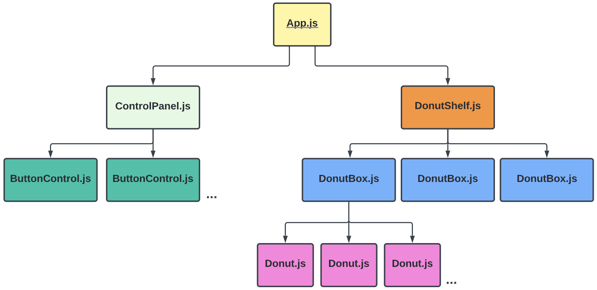
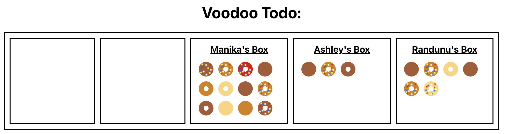
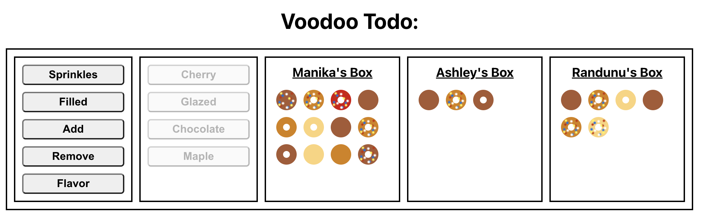

# Voodoo Todo

## Summary

First you do Todo and now you do Voodoo! This repo contains a partially complete application to customize your donut orders. Upon completion, this app will add/remove donuts from individual boxes, and alter the sprinkles, filling, and flavor properties of individual donuts. This application was created with [CRA](https://create-react-app.dev/) and functional components with [React Hooks](https://reactjs.org/docs/hooks-intro.html).

---

## Getting Started

1. Install dev dependencies with: `npm install`
2. Run the the application in development mode with `npm start`

### Section 1: Give. Me. Donuts.

##### Objective: Display the donuts.

In this repo, you will find a skeleton of the application with completed styling. Take a moment to parse through the files and align the code conceptually to the flow chart below. There is no database in this application. All of the state is stored and manipulated in memory within the `App.js` and `utils.js` files. The action buttons are rendered via the `ControlPanel.js` and the donut boxes are rendered via `DonutShelf.js`. This allows an optimum workflow to take advantage of reusable React components.

##### Step 1:

An instance of [useState](https://reactjs.org/docs/hooks-reference.html#usestate) is used to create the stateful value of `donutShelfData` in `App.js`. This value initialized with `initialData` from `const.js`. Analyze this array and familiarize yourself with the elements and their shape.

This data is needed to render the `<DonutShelf />` component. Pass `donutShelfData` as a [prop](https://reactjs.org/docs/components-and-props.html).

##### Step 2:

The `initialData` array contains data for three boxes of donuts. React's JSX accepts [embedded map()](https://reactjs.org/docs/lists-and-keys.html#embedding-map-in-jsx) listing. Map through the `initialData` array and render the three `<DonutBox />` components.

Remember to pass a [key](https://reactjs.org/docs/lists-and-keys.html#keys) prop to mapped React components. There is an existing unique prop available at each level.

##### Step 3:

To render individual donuts within `<DonutBox />` you will need the data from that specific box. This can be obtained from the first argument in [map's callback function](https://developer.mozilla.org/en-US/docs/Web/JavaScript/Reference/Global_Objects/Array/map) and passed to `<DonutBox />` as a [prop](https://reactjs.org/docs/components-and-props.html).

##### Step 4:

The same logic from Steps 2 & 3 can be used to map through the `donuts` array in each box. You will need individual `donutData` to properly display the donuts.

This is the expected view by this point:

If your screen looks like this, bask in the deep-fried glory of your donut listing powers!!

### Section 2: Give me the CRUDy options!

##### Objective: Render the Action and Type buttons.

[CRUD](https://en.wikipedia.org/wiki/Create,_read,_update_and_delete#:~:text=In%20computer%20programming%2C%20create%2C%20read,computer%2Dbased%20forms%20and%20reports.) stands for Create, Read, Update, and Delete. They are the four basic operations for persisting data. We are not saving to a database in this app, but we will replicate this behavior in our `donutShelfData` state instance.

##### Step 1:

Using the same strategy as Section 1, modify the `<ControlPanel />` component to render multiple `<ButtonControl />` components from the `actionOptions` and `flavorOptions` listed in `const.js`.

This is the expected view by this point:

**Note:** The flavor buttons will be disabled until the Section 3 is implemented.

### Section 3: Draw the rest of the owl

##### Objective: Add functionality to the Action Buttons

This app is riddled with `ReplaceMeWithCorrectFunction`, `ReplaceWithCorrectValue`, and `TODO` comments. Track down the correct functions, values and complete the missing helper functions in `utils.js`. Use context clues and the [React Documentation](https://reactjs.org/) to help guide you.

**Note:** This is the first test of this instructional repository. If something seems off, contact Jeff for clarification.
